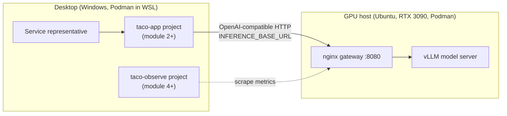
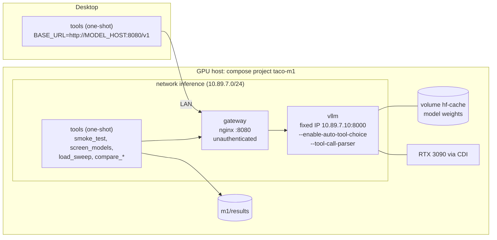
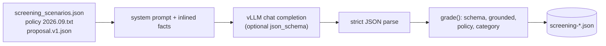
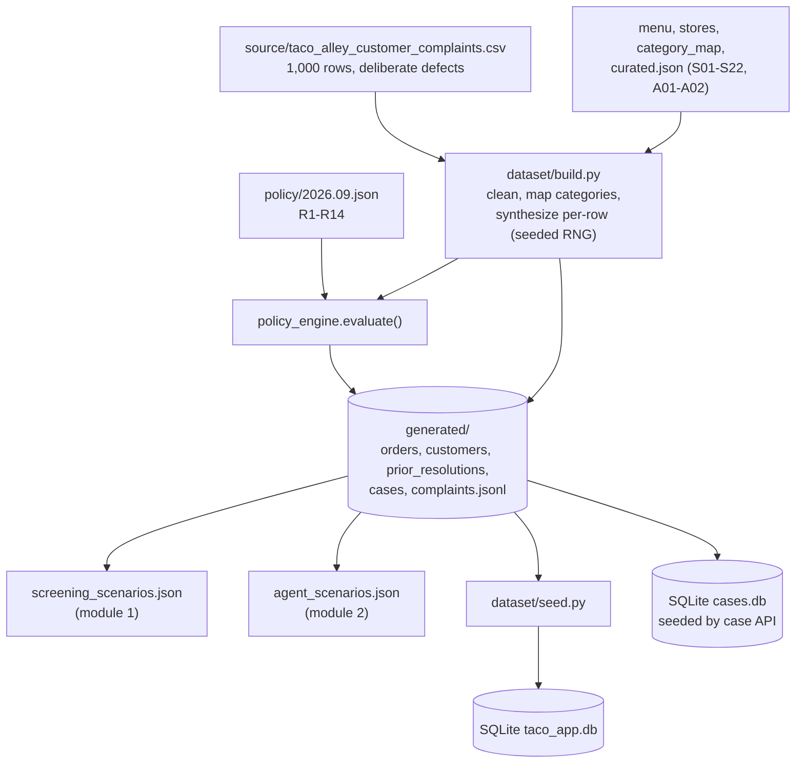
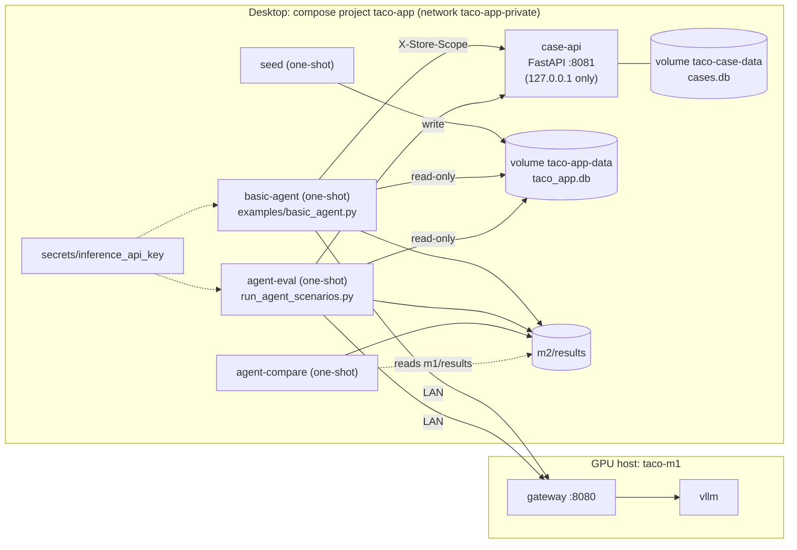
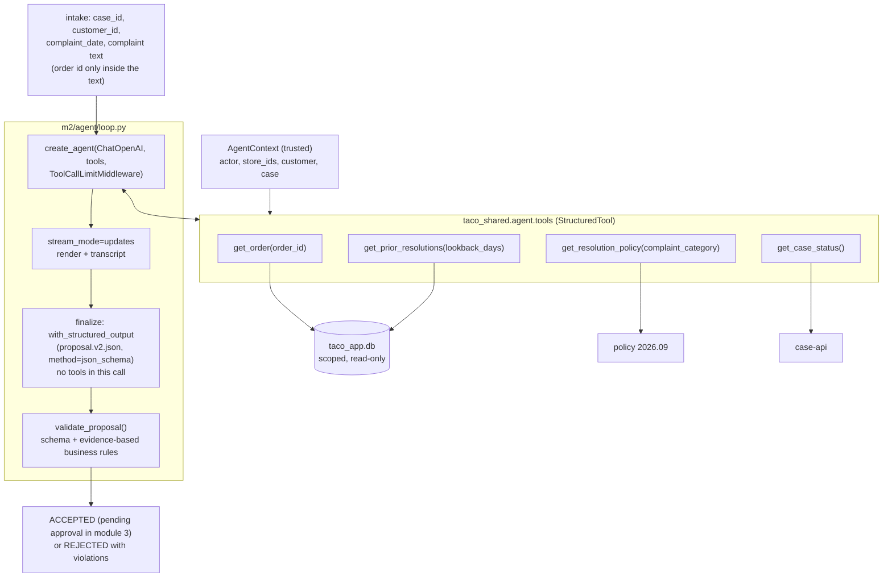
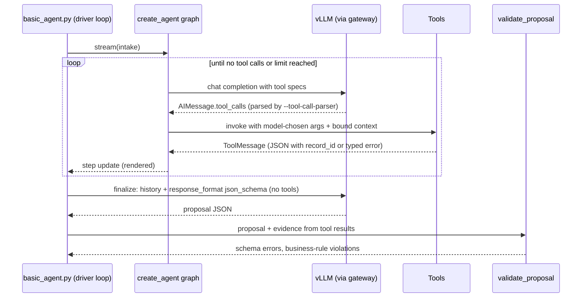
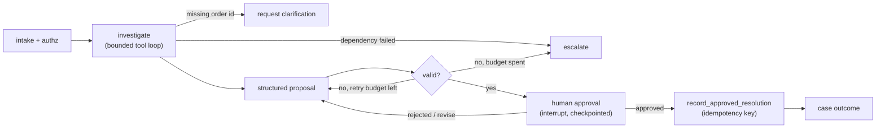
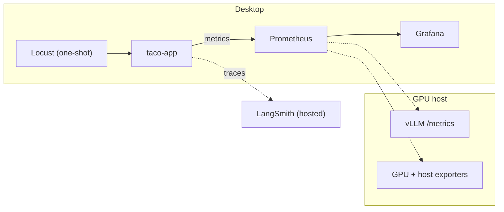

# Architecture of the Course Demonstration

This document describes the Taco Alley complaint-resolution system as it grows module by module. Each
section shows what exists at the end of that module. Update it when a module is completed: change the
module's status, replace planned diagrams with what was built, and keep earlier sections accurate if
shared components change.

| Module | Status | Adds |
| --- | --- | --- |
| [1](#module-1-hosting-a-small-language-model) | Implemented | vLLM model server, nginx gateway, screening and load tools |
| [2](#module-2-building-an-slm-agent-with-tools) | Implemented | Shared dataset and package, mock case API, LangChain agent with typed tools, structured proposal and validator, agent evaluation |
| [3](#module-3-orchestrating-and-hardening-the-agent-workflow-planned) | Planned | LangGraph workflow in a complaint API, durable checkpoints, human approval, idempotent actions, failure handling |
| [4](#module-4-monitoring-and-tracing-planned) | Planned | Prometheus, Grafana, GPU/host exporters, structured logs, LangSmith tracing, Locust |
| [5](#module-5-quality-releases-and-cost-planned) | Planned | Quality sampling and scoring, model release and rollback, cost per successful resolution |
| [6](#module-6-security-and-auditing-planned) | Planned | TLS and service keys at the gateway, rate limits, authenticated metrics, user roles, audit store |

## System context

Two machines: a dedicated GPU host serves the model; the desktop runs the application, tooling, and
(from module 4) monitoring. A single machine can run both, using the same configuration contract.

The inference connection contract shared by every client:

| Setting | Example | Source |
| --- | --- | --- |
| `INFERENCE_BASE_URL` | `http://<MODEL_HOST>:8080/v1` | `.env` |
| `INFERENCE_MODEL` | `qwen3-14b` | `.env` |
| `INFERENCE_EXTRA_BODY` | `{"chat_template_kwargs": {"enable_thinking": false}}` | `.env` |
| service credential | file mounted at `/run/secrets/inference_api_key` | `secrets/` (enforced from module 6) |

---

## Module 1: Hosting a Small Language Model

One Podman Compose project (`taco-m1`) on the GPU host. vLLM is published only on loopback; the
gateway is the only path from the LAN. Disposable tool containers run the smoke test, screening, and
load sweeps from either host.

Screening sends each scenario with its order record, prior resolutions, and the policy inlined in
the prompt, and grades the JSON answer. No tools are involved.

---

## Module 2: Building an SLM Agent with Tools

### Shared foundation

Code, data, and services used by more than one module moved into `shared/`. The complaint CSV is the
single source for customers, stores, and complaint text; a deterministic build synthesizes orders,
delivery times, prior resolutions, and cases, labels every row with a reference policy engine, and
renders the same curated scenarios two ways: facts inlined (module 1) and facts behind tools
(module 2).

### Deployment

The application project (`taco-app`) runs on the desktop and consumes the module 1 gateway; it never
starts or stops the model server. Each SQLite file has exactly one owning service.

### Agent design

The teaching script builds a LangChain `create_agent` agent with four read-only tools and drives it
with its own loop: it streams every step, then makes a separate structured-output call and validates
the proposal. Trusted context (actor, store scope, customer, case) is bound into the tools by the
application and never appears in the tool schemas.

One investigation, as the model and tools exchange messages:

What the module 2 loop intentionally lacks (added in module 3): durable state, custom routing for
clarification and escalation, retry budgets, and a human-approval pause before any action.

---

## Module 3: Orchestrating and Hardening the Agent Workflow (planned)

From the outline: a complaint API in `taco-app` runs a LangGraph workflow with a durable SQLite
checkpointer, deterministic routing around a bounded investigation loop, validation with a bounded
correction attempt, a human-approval interrupt bound to the exact proposal version, and an idempotent
`record_approved_resolution` operation against the case API. Reuses the module 2 model factory,
tools, prompts, and validator from `shared/`.

## Module 4: Monitoring and Tracing (planned)

Adds an independent `taco-observe` project on the desktop (Prometheus, Grafana), host and GPU
exporters on the model host, structured operational logs, LangSmith traces for the agent, and Locust
load generation. Prometheus first scrapes vLLM `/metrics` without authentication; module 6 moves that
scrape behind the gateway.

## Module 5: Quality, Releases, and Cost (planned)

Samples completed proposals into a restricted evaluation store, scores them with deterministic checks
and a rubric, flags degraded outputs for review, compares candidate models or serving settings against
a pinned baseline, rolls back on regression, and reports cost per successful resolution.

## Module 6: Security and Auditing (planned)

The gateway gains TLS, per-service bearer keys (the module 2 secret file starts being enforced), key
rotation, route restrictions, request-size and rate limits, and an authenticated metrics route that
Prometheus switches to. The application enforces user roles and store scope (already in the tools) and
writes protected audit records separate from operational logs and quality samples.
